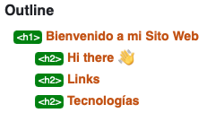

# ⛺ Semana 2

## Clase 1

### Ejercicio 1:
Hugo, Paco y Luis tienen una cantidad desconocida de monedas cada uno.
Sabemos que Paco tiene el doble de monedas que Hugo y que Luis tiene 10 monedas más que Paco.

Si los tres juntos tienen un total de 85 monedas.

**¿Cuántas monedas tiene cada uno?**

```javascript
// Asignamos la cantidad de monedas de Hugo, este valor es el que tienes que resolver. 
let hugo = 15; 

// Calculamos la cantidad de monedas de Paco y Luis en función de Hugo.
let paco = 2 * hugo;
let luis = paco + 10;

// Sumamos las cantidades de monedas de los tres amigos 
let total = hugo + paco + luis;

if (total === 85) {
    console.log("Hugo: " + hugo)
    console.log("Paco: " + paco)
    onsole.log("Luis: " + luis)
}
```

### Ejercicio 2:
¿Cómo puedo implementar una expresión para verificar si un valor es un objeto?
```javascript
typeof obj === "object" && obj != null
```

## Clase 2
### Ejercicio 1:

 En el ejercicio de calentamiento simplemente define un objeto `human` que tiene caracteristicas de mi persona (nombre, edad, estatura, sexo etc..) mi objeto quedo de esta manera:  

```javascript
const human = {
    Id: Symbol('yrguativa')
    Name: "Yilmer Guativa",
    Age: 29,
    Sex: "Masculino",
    Height: 1.72,
    IsDev: true
}
```
###  Ejercicio 2
¿Cómo puedo implementar una expresión para verificar si un valor es un array?
```javascript
// option 1
typeof x === 'object' && x != null && x.__proto__  == [].__proto__

// option 1
Array.isArray(x)
```

## Clase 3
### Ejercicio 1:

Actualizar el html de la página [index.html](./index.html) con etiquetas semanticas.

### Ejercicio 2:

Utilizar el validaro de html  ✅



## Clase 4
### Ejercicio 04:

1) Cree un formulario con la estructura vista en clase.
2) Encontre en Google una function que me deshabilita el boton por default